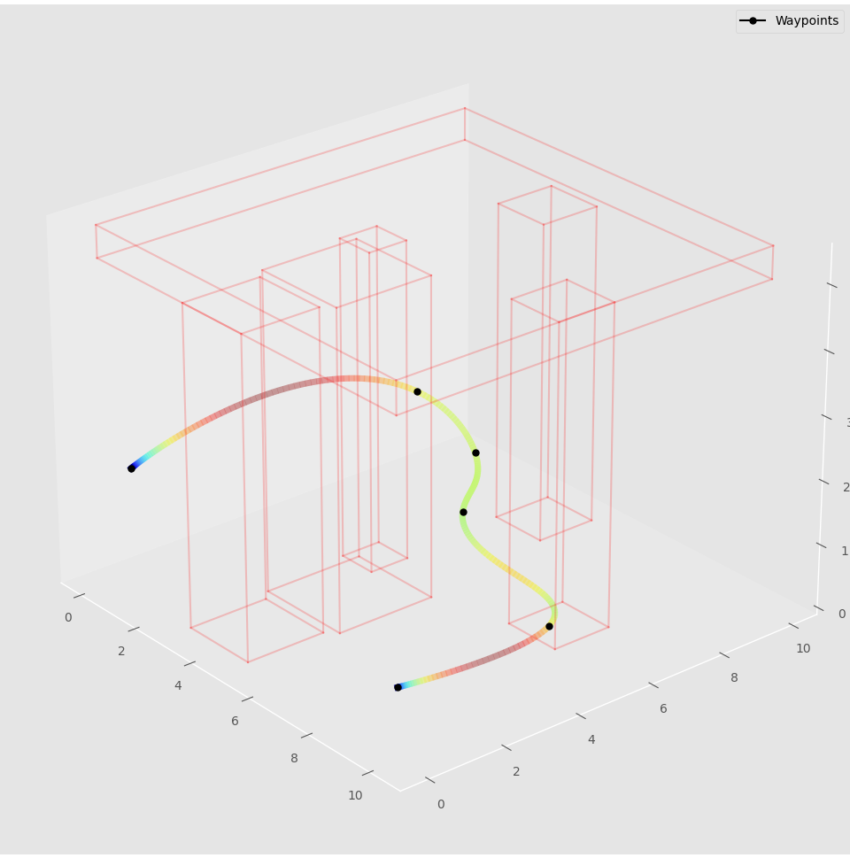
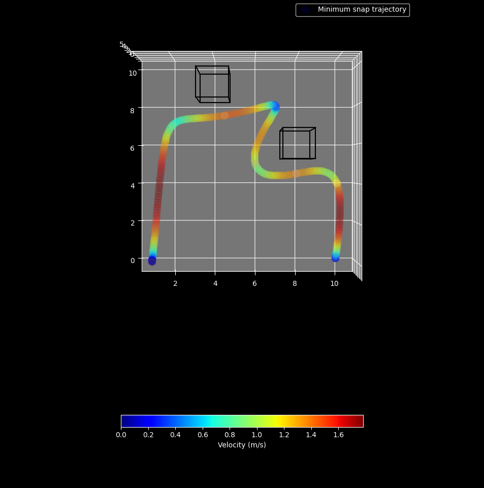

## 3D UAV simulation and autonomous control for path tracking

### Controller response

### 3D snap

### Result on the Helix path
https://user-images.githubusercontent.com/17160701/209675444-38a1941d-f8d2-4477-b8ec-09222fa9c32d.mp4

### 1. Control  

  

source: A platform for aerial robotics research and demonstration: The Flying Machine Arena  
Sergei Lupashin, Markus Hehn, Mark W. Mueller, Angela P. Schoellig, Michael Sherback, Raffaello D’Andrea

### 2. Trajectory Planner with minimum snap

A minimum Snap trajectory has been implemented for this project. Here is one result for an arbitrary trajectory, we can find the comparison between a naive trajectory (just connecting waypoints with a straight line) and the optimal one (Minimum snap)

#### Without collision check

#### With collision check (upper right waypoint is mandatory)

https://user-images.githubusercontent.com/17160701/211073314-78f419ca-e53b-4a88-a63e-565018963ce7.mp4

Finding a path (waypoints) to a goal location is one of many important steps for an autonomous robot. But this path must 
satisfy some conditions such that a controller can handle it. Some of these conditions can be summarized as follows:

- The path must be feasible
- The path must be collision-free
- The path must be differentiable
- The path must be smooth enough
  
The thing is that a system as a quadrotor can be represented (in this case) as a 4th-order system, so a path for this kind of system must be differentiable at least 4 times:
Let's denote k as the order of derivative:

- k=1 : velocity
- k=2 : acceleration
- k=3 : jerk
- k=4 : snap

So a good trajectory for this system can be thought of as a minimum snap trajectory, hence a trajectory that minimizes the snap criterion. So we need to find the optimal path  

$$
\boxed{
    x^{*}(t) = argmin_{x(t)} = \int_{0}^{T} \mathcal{L}(\ddddot{x}, \dddot{x}, \ddot{x}, \dot{x}, x, t) dt =  \int_{0}^{T} \ddddot{x}^{2} dt
}
$$

where $\mathcal{L}$ is the Lagrangian of the system and $\ddddot{x}$ is the snap of the trajectory.

We can find the optimal path by solving the Euler-Lagrange equation:  

$$
\boxed{
    x(t) = c_{7}t^7 + c_{6}t^6 + c_{5}t^5 + c_{4}t^4 + c_{3}t^3 + c_{2}t^2 + c_{1}t + c_{0}
}
$$  

Why 8 coefficients? Because we have 8 boundary conditions to respect. The boundary conditions are:
- Position at t=0, and t=T
- Velocity at t=0, and t=T
- Acceleration at t=0, and t=T
- Jerk at t=0, and t=T

By applying these conditions, we can find the 8 coefficients, hence the optimal path that minimizes the snap criterion.  

Differentiating this equation gives the velocity/acceleration/jerk/snap constraints and so on...   

$$
\dot{x}(t) = 7c_{7}t^6 +6 c_{6}t^5 + 5c_{5}t^4 + 4c_{4}t^3 + 3c_{3}t^2 + 2c_{2}t + c_{1}
$$

what we are interested in is finding the coefficients `c0, c1, c2, c3, c4, c5` that satisfy all the constraints (boundary conditions) mentioned above.
_note: If I have another constraint to respect, I will have to find _one more coefficient_.

Each of the conditions gives an equation, so we can represent them in a **Matrix** $A$. We can write the equation in terms of unknown constants and boundary conditions. Solving for these constants (coefficients) is a linear problem.

To respect the __position constraint__:  

> $$x(t) = c_{7}t^7 + c_{6}t^6 + c_{5}t^5 + c_{4}t^4 + c_{3}t^3 + c_{2}t^2 + c_{1}t + c_{0}$$
> 
> $$x(0) = c_{0}$$
> 
> $$x(T) = c_{7}T^7 + c_{6}T^6 + c_{5}T^5 + c_{4}T^4 + c_{3}T^3 + c_{2}T^2 + c_{1}T + c_{0}$$

Matrix form __at t=0__    

$$
\begin{bmatrix} 0 & 0 & 0 & 0 & 0 & 0 & 0 & 1 \end{bmatrix} \cdot  \begin{bmatrix}
                                                                        c_{7} \\
                                                                        c_{6} \\
                                                                        c_{5} \\
                                                                        c_{4} \\
                                                                        c_{3} \\
                                                                        c_{2} \\
                                                                        c_{1} \\
                                                                        c_{0}
                                                                        \end{bmatrix} = p_0
$$

Matrix form __at t=T__    

$$
\begin{bmatrix} T^7 & T^6 & T^5 & T^4 & T^3 & T^2 & T^1 & T^0 \end{bmatrix} \cdot  \begin{bmatrix}
                                                                                        c_{7} \\
                                                                                        c_{6} \\
                                                                                        c_{5} \\
                                                                                        c_{4} \\
                                                                                        c_{3} \\
                                                                                        c_{2} \\
                                                                                        c_{1} \\
                                                                                        c_{0}
                                                                                        \end{bmatrix} = p_T
$$

To respect the __velocity constraint__ we differentiate the position equation:  

> $$\dot{x}(t) = 7c_{7}t^6 +6 c_{6}t^5 + 5c_{5}t^4 + 4c_{4}t^3 + 3c_{3}t^2 + 2c_{2}t + c_{1}$$
> 
> $$\dot{x}(0) = c_{1}$$
> 
> $$\dot{x}(T) = 7c_{7}T^6 +6 c_{6}T^5 + 5c_{5}T^4 + 4c_{4}T^3 + 3c_{3}T^2 + 2c_{2}T + c_{1}$$  

Matrix form __at t=0__    

$$
\begin{bmatrix} 0 & 0 & 0 & 0 & 0 & 0 & 1 & 0 \end{bmatrix} \cdot  \begin{bmatrix}
                                                                        c_{7} \\
                                                                        c_{6} \\
                                                                        c_{5} \\
                                                                        c_{4} \\
                                                                        c_{3} \\
                                                                        c_{2} \\
                                                                        c_{1} \\
                                                                        c_{0}
                                                                        \end{bmatrix} = v_0
$$

Matrix form __at t=T__    

$$
\begin{bmatrix} 7T^6 & 6T^5 & 5T^4 & 4T^3 & 3T^2 & 2T^1 & T^0 & 0 \end{bmatrix} \cdot  \begin{bmatrix}
                                                                                        c_{7} \\
                                                                                        c_{6} \\
                                                                                        c_{5} \\
                                                                                        c_{4} \\
                                                                                        c_{3} \\
                                                                                        c_{2} \\
                                                                                        c_{1} \\
                                                                                        c_{0}
                                                                                        \end{bmatrix} = v_T
$$

To respect the __acceleration constraint__ we differentiate the velocity equation:  

> $$\ddot{x}(t) = 42c_{7}t^5 + 30c_{6}t^4 + 20c_{5}t^3 + 12c_{4}t^2 + 6c_{3}t + 2c_{2}$$
> 
> $$\ddot{x}(0) = 2c_{2}$$
> 
> $$\ddot{x}(T) = 42c_{7}T^5 + 30c_{6}T^4 + 20c_{5}T^3 + 12c_{4}T^2 + 6c_{3}T + 2c_{2}$$  

Matrix form __at t=0__    

$$
\begin{bmatrix} 0 & 0 & 0 & 0 & 0 & 2 & 0 & 0 \end{bmatrix} \cdot  \begin{bmatrix}
                                                                        c_{7} \\
                                                                        c_{6} \\
                                                                        c_{5} \\
                                                                        c_{4} \\
                                                                        c_{3} \\
                                                                        c_{2} \\
                                                                        c_{1} \\
                                                                        c_{0}
                                                                        \end{bmatrix} = a_{0}
$$

Matrix form __at t=T__  

$$
\begin{bmatrix} 42T^5 & 30T^4 & 20T^3 & 12T^2 & 6T^1 & 2T^0 & 0 & 0 \end{bmatrix} \cdot  \begin{bmatrix}
                                                                                        c_{7} \\
                                                                                        c_{6} \\
                                                                                        c_{5} \\
                                                                                        c_{4} \\
                                                                                        c_{3} \\
                                                                                        c_{2} \\
                                                                                        c_{1} \\
                                                                                        c_{0}
                                                                                        \end{bmatrix} = a_{T}
$$

To respect the __jerk constraint__ we differentiate the acceleration equation:  

> $$\dddot{x}(t) = 210c_{7}t^4 + 120c_{6}t^3 + 60c_{5}t^2 + 24c_{4}t + 6c_{3}$$
> 
> $$\dddot{x}(0) = 6c_{3}$$
> 
> $$\dddot{x}(T) = 210c_{7}T^4 + 120c_{6}T^3 + 60c_{5}T^2 + 24c_{4}T + 6c_{3}$$  

Matrix form __at t=0__  

$$
\begin{bmatrix} 0 & 0 & 0 & 0 & 6 & 0 & 0 & 0 \end{bmatrix} \cdot  \begin{bmatrix}
                                                                        c_{7} \\
                                                                        c_{6} \\
                                                                        c_{5} \\
                                                                        c_{4} \\
                                                                        c_{3} \\
                                                                        c_{2} \\
                                                                        c_{1} \\
                                                                        c_{0}
                                                                        \end{bmatrix} = j_{0}
$$

Matrix form __at t=T__  

$$
\begin{bmatrix} 210T^4 & 120T^3 & 60T^2 & 24T^1 & 6T^0 & 0 & 0 & 0 \end{bmatrix} \cdot  \begin{bmatrix}
                                                                                        c_{7} \\
                                                                                        c_{6} \\
                                                                                        c_{5} \\
                                                                                        c_{4} \\
                                                                                        c_{3} \\
                                                                                        c_{2} \\
                                                                                        c_{1} \\
                                                                                        c_{0}
                                                                                        \end{bmatrix} = j_{T}
$$

All 8 constraints can be written as an 8x8 matrix to find the coefficients of the polynomial (coefficients of the trajectory).
The full matrix is the following:

$$
A = \begin{bmatrix}
        0 & 0 & 0 & 0 & 0 & 0 & 0 & 1 \\
        T^7 & T^6 & T^5 & T^4 & T^3 & T^2 & T & 1 \\
        0 & 0 & 0 & 0 & 0 & 0 & 1 & 0 \\
        7T^6 & 6T^5 & 5T^4 & 4T^3 & 3T^2 & 2T & 1 & 0 \\
        0 & 0 & 0 & 0 & 0 & 2 & 0 & 0 \\
        42T^5 & 30T^4 & 20T^3 & 12T^2 & 6T & 2 & 0 & 0 \\
        0 & 0 & 0 & 0 & 6 & 0 & 0 & 0 \\
        210T^4 & 120T^3 & 60T^2 & 24T & 6 & 0 & 0 & 0 \\
        \end{bmatrix}
$$

So $A$ is the matrix of the constraints, and we need to find the vector of the coefficients of the polynomial $c$ from $A$ and $b$ the vector of the constraints:

$$\boxed{c = A^{-1}b}$$  

#### Define $b$ vector

$b$ is a column vector of 8 elements, each element is a constraint.  
Let's say we want a trajectory that starts from $x=2$, and ends at $x=5$, with an average velocity of $v=1$.

$$
b = \begin{bmatrix}
        2 \\
        5 \\
        1 \\
        1 \\
        0 \\
        0 \\
        0 \\
        0 \\
        \end{bmatrix}
$$

#### Find the coefficients $c$ of the polynomial

$$
c = \begin{bmatrix}
        0 & 0 & 0 & 0 & 0 & 0 & 0 & 1 \\
        T^7 & T^6 & T^5 & T^4 & T^3 & T^2 & T & 1 \\
        0 & 0 & 0 & 0 & 0 & 0 & 1 & 0 \\
        7T^6 & 6T^5 & 5T^4 & 4T^3 & 3T^2 & 2T & 1 & 0 \\
        0 & 0 & 0 & 0 & 0 & 2 & 0 & 0 \\
        42T^5 & 30T^4 & 20T^3 & 12T^2 & 6T & 2 & 0 & 0 \\
        0 & 0 & 0 & 0 & 6 & 0 & 0 & 0 \\
        210T^4 & 120T^3 & 60T^2 & 24T & 6 & 0 & 0 & 0 \\
        \end{bmatrix}^{-1} \cdot \begin{bmatrix}
                                    2 \\
                                    5 \\
                                    1 \\
                                    1 \\
                                    0 \\
                                    0 \\
                                    0 \\
                                    0 \\
                                    \end{bmatrix}
$$

:rocket:

